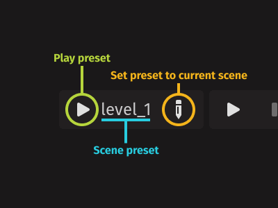

# Godot Run Preset

> A quick and easy custom play button for Godot 4.

## How to use

### Shortcuts

- <kbd>f4</kbd> - Run preset
- <kbd>shift</kbd> + <kbd>f4</kbd> - Set preset to current scene

See [How do I change the keyboard shortcuts?](#how-do-i-change-the-keyboard-shortcuts)

## FAQ

### What do I need to change in my `.gitignore`?

Nothing. All data is stored in `res://.godot/editor` so as long as that folder is ignored this plugin should play along well with any version control system.

### How do I change the keyboard shortcuts?

Open `res://addons/run_preset/toolbar.tscn` and edit the shortcuts under the 'Play' and 'Edit' buttons. PRs welcome to integrate this with Godot's Editor Keyboard Shortcuts menu.

### Why not use [gro-david/godot-custom-play-buttons

](https://github.com/gro-david/godot-custom-play-buttons)?
> This plugin is faster to use and plays better with version control. Use the other plugin if more control is needed (such as multiple presets).
